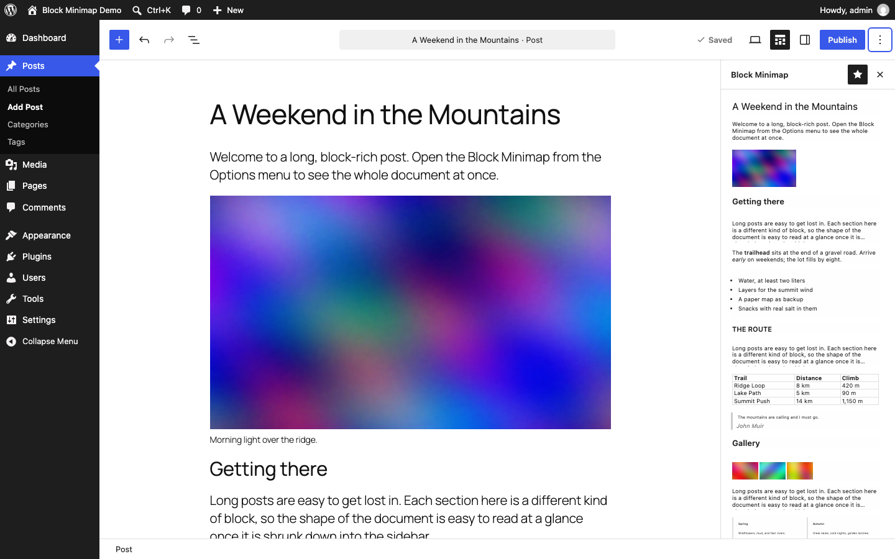
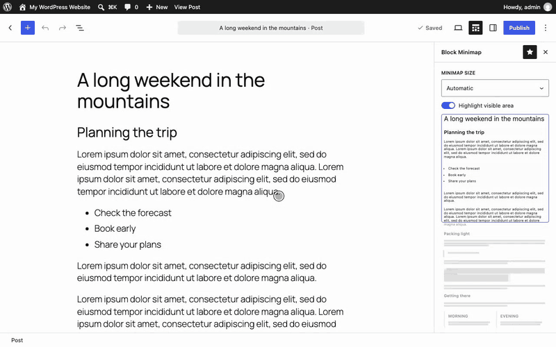

# Block Minimap

> A minimap for the WordPress block editor (Gutenberg).

   

## Screenshot

## Screencast

The minimap and the editor scroll together: scrolling the post moves the minimap along with it, and scrolling the minimap moves the post. A frame marks the part of the minimap visible in the editor, with the rest dimmed, and dragging the frame scrolls the post.

## Requirements

* PHP 5.6+
* [WordPress](https://wordpress.org/) 5.4+

## Installation

1. Install the plugin via the plugin installer, either by searching for it or uploading a .zip file.
1. Activate the plugin.
1. Use Block Minimap!

## Support Level

**Active:** adamsilverstein is actively working on this, and we expect to continue work for the foreseeable future including keeping tested up to the most recent version of WordPress.  Bug reports, feature requests, questions, and pull requests are welcome.

## Changelog

A complete listing of all notable changes to Block Minimap are documented in [CHANGELOG.md](https://github.com/adamsilverstein/block-minimap/blob/master/CHANGELOG.md).

## Contributing

Please read [CODE_OF_CONDUCT.md](https://github.com/adamsilverstein/block-minimap/blob/master/CODE_OF_CONDUCT.md) for details on our code of conduct, [CONTRIBUTING.md](https://github.com/adamsilverstein/block-minimap/blob/master/CONTRIBUTING.md) for details on the process for submitting pull requests to us, and [CREDITS.md](https://github.com/adamsilverstein/block-minimap/blob/master/CREDITS.md) for a listing of maintainers of, contributors to, and libraries used by Block Minimap.
